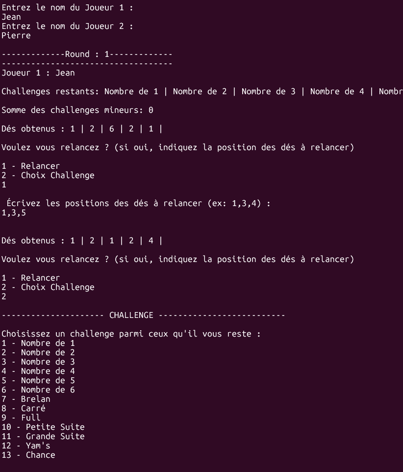

# Jeu de yams
Ce jeu est un des projets réalisé de manière encadrée à l'IUT Robert Schumann en première année. Le jeu est constitué d'une partie en c# permettant de jouer en console ainsi que d'une interface web permettant de visualiser les résultats de la partie. <br><br>
/!\ Étant donné que ce projet a été réalisé en début de première année, certains conceptes tels que la POO  par exemple n'ont pas forcément été réspecté.<br>
/!\ D'autre part, l'interface web ne permet actuellement plus de visionner les résultats car les serveurs qui nous étaient mis à disposition pour ce projet ont été désactivé.

# Technologies utilisées

**Partie jeu :** C#

**Interface web :** HTML, CSS, JavaScript

# Guide d'installation

1. **Cloner le dépôt et s'y déplacer**
```bash
git clone https://github.com/IamVZ/JeuDeYams.git
cd JeuDeYams/jeu
```
2. Exécuter :
```bash
mcs ./index.cs
mono ./index.exe
```

A la fin d'une partie, un fichier json est créé, puis il faudrait normalement l'importer dans l'interface web pour afficher les résultats de la partie. Cependant comme indiqué précédemment, les serveurs ont été coupés donc cela ne marchera plus.

# Exemple de vue en console



# Exemple de vue de l'interface


